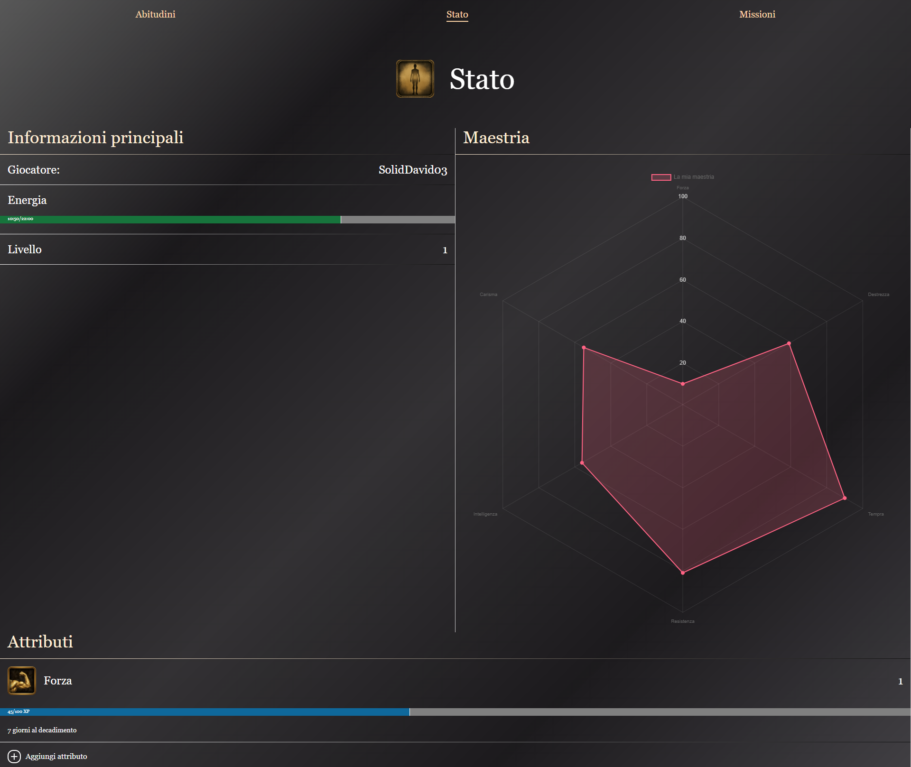
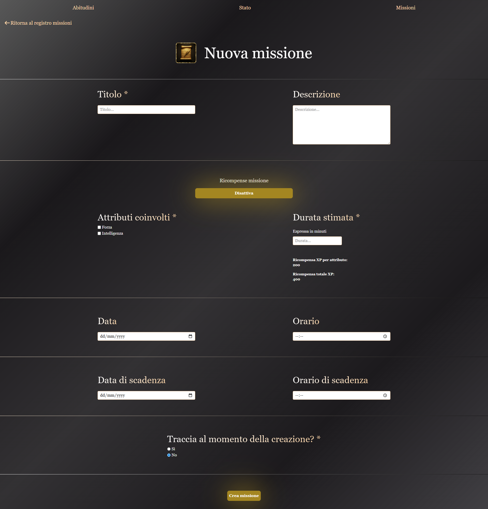
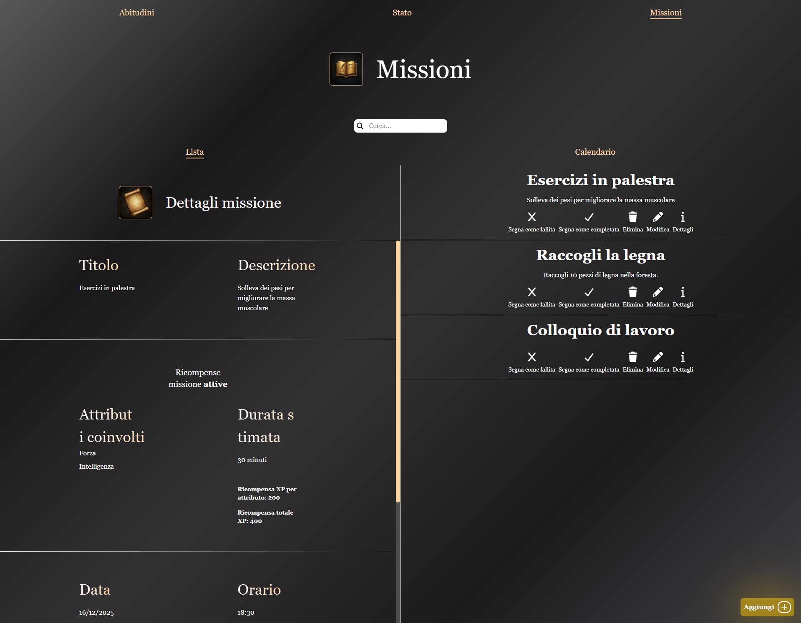

# 🗡️ Grindborne - Documentazione Progetto

> [!WARNING]
> **PROGETTO NON FINITO — WORK IN PROGRESS**

> _Trasforma la tua routine quotidiana in un'avventura epica_

## 📋 Indice

- [Panoramica](#-panoramica)
- [Stato del progetto](#stato-del-progetto)
- [Funzionalità](#-funzionalità)
- [Design e UI/UX](#-design-e-uiux)
- [Tecnologie](#-tecnologie)

## 🎯 Panoramica

### Perché Grindborne

Grindborne nasce da una frustrazione personale: rimanere motivati e superare
la procrastinazione, anche quando si hanno obiettivi chiari davanti a sé.

Ho provato molte app — dalle semplici to-do list ai tracker di abitudini più
complessi, inclusa lifeRPG, che mi ha introdotto per la prima volta al concetto
di gamificare la vita reale. Pur essendo potente nell'idea, la trovavo
eccessivamente complessa e carica di funzionalità che sembravano forzate più
che utili. Ho capito che quel tipo di app poteva funzionare solo per qualcuno
in un momento molto particolare della propria vita.

Col tempo, qualcosa si è fatto più chiaro: mi sono innamorato del genere RPG,
in particolare dei giochi soulsborne come Elden Ring. E più ci pensavo, più
mi convincevo che la vita reale, se fosse un videogioco, sarebbe un RPG —
open world, ricco di lore, e senza nessuno che ti dice cosa fare.

Ma soprattutto, sarebbe un souls-like.

Non nel senso del "morire continuamente e sentirsi a pezzi" — quello è
fraintendere completamente il punto. I giochi soulsborne non sono progettati
per umiliarti. Sono progettati per insegnarti. Ogni morte è una lezione:
impara lo schema, adatta il tuo approccio e torna più forte. Fare la stessa
cosa all'infinito aspettandosi un risultato diverso non è perseveranza — è
la definizione di follia. Quella filosofia, tolta dai pixel e dalle boss fight,
si applica perfettamente alla vita reale.

Il problema è che questa lezione, per quanto potente, è facile da dimenticare.
Quando falliamo nella vita reale, raramente ci fermiamo a chiederci: _"Cosa è
andato storto e come aggiusto il tiro?"_ Ci sentiamo semplicemente in colpa.
Grindborne vuole cambiare questa prospettiva.

Quello che voglio costruire è un'app che combini la semplicità di strumenti
come Google Tasks per i task una tantum, il monitoraggio della costanza dei
tracker di abitudini, e un sistema di gamification che rifletta davvero come
funziona la crescita nel mondo reale. Nella vita reale, le competenze non sono
statiche. Raggiungere un livello di padronanza e poi trascurarlo significa
vederlo svanire. Il sistema di Grindborne è progettato per rispecchiare questo:
il tuo progresso è vivo, e va coltivato.

L'obiettivo non è rendere la produttività simile a un gioco per pura novità.
È usare il linguaggio dei videogiochi — un linguaggio che molti di noi già
parlano fluentemente — per rendere la lotta al miglioramento personale qualcosa
di significativo, visibile, e per cui valga davvero la pena lottare.

### La Filosofia

Grindborne nasce dalla fusione tra:

- **La filosofia Soulsborne**: imparare dagli errori, perseveranza, crescita incrementale (git gud)
- **Produttività personale**: combattere la procrastinazione e mantenere la motivazione

**Non si tratta di "morire ripetutamente" ma di "livellare" nella vita reale.**

### Il Problema

- Difficoltà nel mantenere la motivazione nonostante obiettivi chiari
- App di produttività esistenti troppo generiche o complesse
- Necessità di un feedback visivo e gamificato del progresso

### La Soluzione

Un'app che trasforma:

- **Task** in **Missioni**
- **Abitudini** in **Grind**
- **Competenze reali** in **Statistiche**
- **Progresso** in **Livelli**

## 🛠️ Stato del progetto

Grindborne è attualmente un progetto **work in progress**.

In questa fase, lo sviluppo del frontend è temporaneamente in pausa per dare priorità
alla progettazione dell'API e del backend, con l'obiettivo di costruire fondamenta solide
prima di proseguire con l'interfaccia utente.

### Focus attuale

- Sviluppo backend con Node.js, Express e PostgreSQL
- Progettazione e organizzazione degli endpoint API
- Gestione autenticazione con JWT
- Definizione della logica applicativa per quest, grind, attributi e stato utente

### Stato delle componenti

- **Frontend**: prototipi UI e prime schermate disponibili, sviluppo momentaneamente sospeso
- **Backend/API**: sviluppo attivo
- **Database**: struttura in evoluzione insieme alla logica backend

## 🎮 Funzionalità

### Funzionalità chiave

| Funzionalità                       | Descrizione                                                                                                                                                                                                                                                                                                                                                                                                                                             |
| ---------------------------------- | ------------------------------------------------------------------------------------------------------------------------------------------------------------------------------------------------------------------------------------------------------------------------------------------------------------------------------------------------------------------------------------------------------------------------------------------------------- |
| **Missioni**                       | Task con scadenza e difficoltà variabile                                                                                                                                                                                                                                                                                                                                                                                                                |
| **Grind**                          | Abitudini (dette grinds) ricorrenti tracciabili                                                                                                                                                                                                                                                                                                                                                                                                         |
| **Statistiche**                    | Attributi personalizzabili con progressione tramite completamento di quest e grind                                                                                                                                                                                                                                                                                                                                                                      |
| **Radar Chart**                    | Visualizzazione maestria attributi                                                                                                                                                                                                                                                                                                                                                                                                                      |
| **Stamina**                        | Una barra della stamina che indica il ciclo sonno/veglia se attivata dall'utente                                                                                                                                                                                                                                                                                                                                                                        |
| **Personalizzazione sound design** | Suoni personalizzabili dall'utente (es. quest completata, level up, decadimento attributo...)                                                                                                                                                                                                                                                                                                                                                           |
| **Sistema Livelli**                | Progresso generale e per singola statistica. Quando si livella in un attributo allora sale di uno anche il livello generale del giocatore il quale è ottenuto con la somma dei livelli degli attributi del giocatore meno 1 tante volte quanti sono gli attributi escluso uno.  **Esempio 1** — Livello 12: Forza 4, Intelligenza 3, Carisma 7 → `4 + 3 + 7 - 2 = 12`  **Esempio 2** — Livello 1: Forza 1, Intelligenza 1 → `1 + 1 - 1 = 1` |

### Meccaniche Avanzate

- **Decadimento Attributi**: Le abilità diminuiscono se non praticate
- **Periodo di Grazia**: Tempo prima dell'inizio decadimento
- **Allocazione XP Automatica**: Sistema imparziale di distribuzione esperienza

## 🎨 Design e UI/UX

### Tema Visivo

- **Ispirazione**: Elden Ring, Dark Souls e Bloodborne UI
- **Icone**: Generate da AI addestrata sulla color palette di Dark Souls 1 per evitare il copyright
- **Tema Colori**: Scuro con accenti brillanti
- **Font**: Stile medievale/antico per titoli

### Mockups

## 💻 Tecnologie

### Frontend

- Libreria: React 19+
- Linguaggio: TypeScript
- Styling: CSS & Tailwind CSS

### Backend

- Linguaggio: TypeScript (Node.js)
- Framework: Express
- Database: PostgreSQL

## 📘 Repository correlati

- **Frontend / App principale**: questo repository
- **Backend / API**: [grindborne-api](https://github.com/Davide-Ficocelli/grindborne-api)
